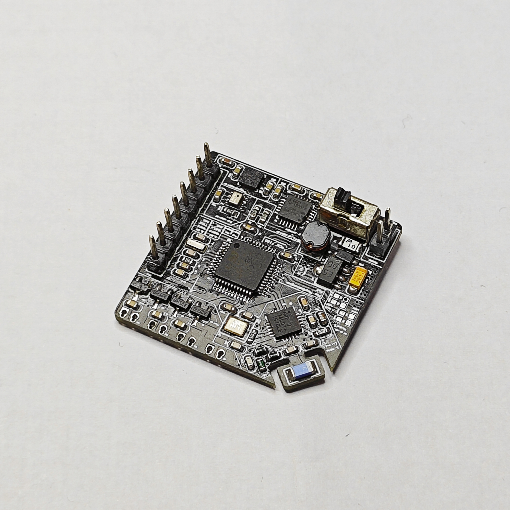
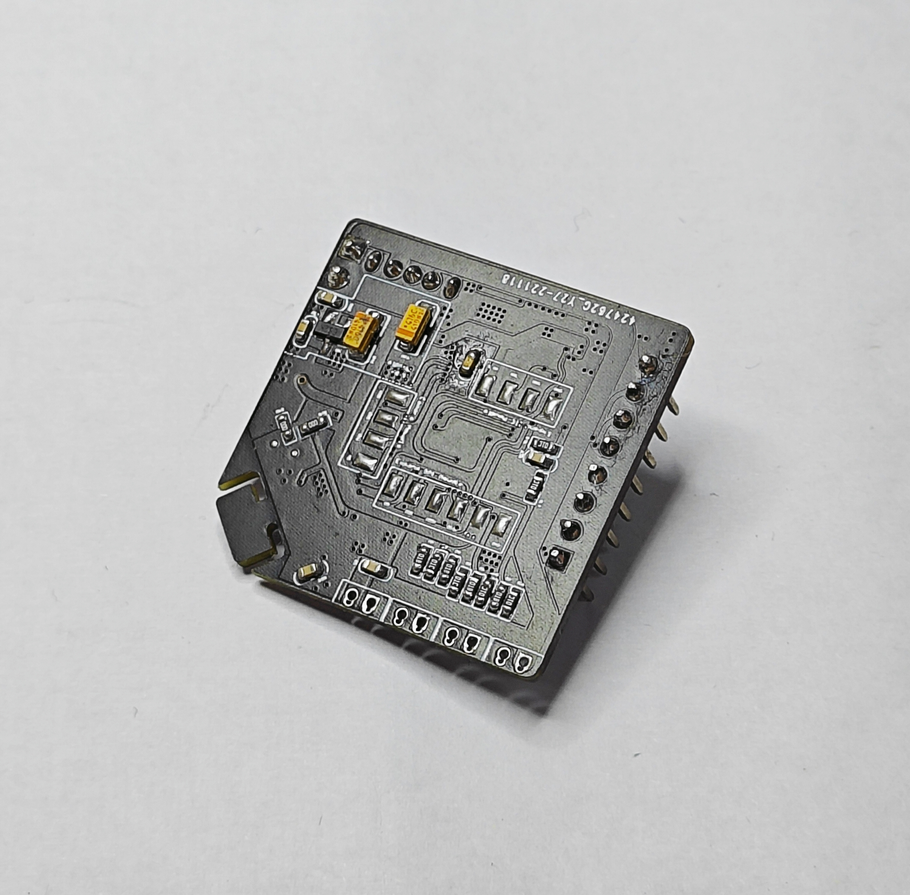
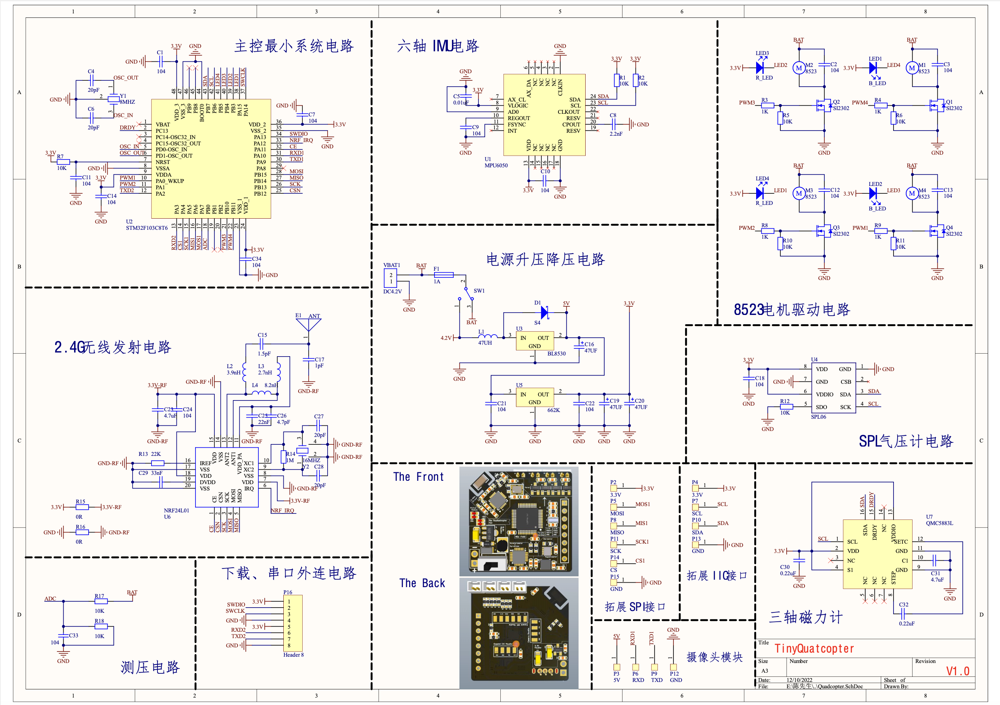

<b>Sep.2018-Jun.2022</b><b>Guangdong Ocean University (GDOU), P.R.China</b>

- **Major:** Automation, Bachelor of Engineering
- **Academic Performance:** GPA: 83.5/100; Rank: Top 10%
- **Graduation Thesis:** Quadcopter Design Based on Real-time Operating System

<b>Sep.2023-Current</b><b>Technion - Israel Institute of Technology, Israel</b>

- **Major:** Mechanical Engineering
- **Academic Performance:** GPA: 91.2/100;
- **Graduation Thesis:** Improving the Energy Efficiency of Actuator by Energy Recycling and Passive Dynamics

**===========================================================================**

RESEARCH EXPERIENCE
======

<b>Dec.2018-Jun.2019</b><b>- Design of electromagnetic car based on Cortex-M4 core.</b>

<body>
  

  In order to meet the development requirements of modern informatization and intelligence, we propose a motion control of the smart car based on the microcontroller of the Cortex-M4 core. This project uses NXP's K66 chip as the main control chip. We design the PCB of the main control circuit and the PCB of the driver circuit by ourselves, and use the op-amp chip to collect the electromagnetic line data of the track, obtain the track information in real-time through information fusion, and combine the PID algorithm for real-time control and obstacle avoidance to realize the intelligence of the car.
  

</body>

<b>Jun.2020-Mar.2021</b><b>- A portable glasses for obstacle detection based on YOLOV2.</b>

<body>
  

  This project is an innovation and entrepreneurship project for college students. The purpose is to design portable smart glasses to assist people in their daily activities. We use the K210 chip as the main control chip. The K210 chip combined with the YOLOV2 detection algorithm is used for real-time detection of the vehicle, and the information is sent to the LabVIEW host computer through the Wi-Fi module so that the user can know the specific situation of the vehicles on both sides in real-time.
  

</body>

<b>Mar.2021-Jun.2021</b><b>- A smart home system based on UCOSIII.</b>

<body>
  

  The whole project is built by STM32CubeMX, using STM32F103C8T6 as the main control chip, using UCOSIII for thread control, judging the current environment by getting each sensor measurement value, and using the pre-set algorithm for the next action. The system can be set in automatic mode and manual mode, and the manual mode is operated by the user's cell phone APP with a Wi-Fi control system. Provides some convenience for home life.
  

</body>

<b>Nov.2021-Jun.2022</b><b>- Quadcopter Design Based on Real-time Operating System.</b>

<body>
  

  "Quadcopter Design Based on Real-time Operating System" belongs to software and hardware design and is also my graduation design paper. I designed a quadcopter which is based on UCOSIII that can be controlled by a wireless remote. I designed the main control PCB by Altium Designer and validated the feasibility of the hardware. By acquiring the acceleration data and angular velocity data from the MPU6050, the real-time angle is obtained by using the quaternion method, combined with the cascade PID algorithm to control the stable flight of the aircraft.
  

</body>

<b>Sep.2022-Jan.2023</b><b>- Design of a passive ankle-thigh exoskeleton.</b>

<body>
  

  In this research, we proposed shifting the leg swing force to the ankle toe-off phase by an exoskeleton and hence decreases the metabolic cost of human walking by 6.7%. The exoskeleton is mounted on the thigh and extends beyond the low leg. A rubber band connects the extended bar and the back of the shoe, passing the torque from the thigh to the ankle. This reduces the ankle torque during the toe-off phase, in which most of the positive energy input from the muscle to the skeleton happens. We have finished the concept, design, and prototype of the exoskeleton and carried out the initial test. Test results show that the metabolic cost of walking with the exoskeleton is 351.1W, about 6.7% decrease compared with that of normal human walking (376.6 W).
  

</body>

**===========================================================================**

INTERN&WORKING EXPERIENCE
======

<b></b>Linux Embedded Development Engineer,

<b>May.2021-Jun.2021</b><b>
- Guangzhou Yueqian Communication Technology Co., Ltd.
</b>

<b></b>Hardware and Software Test Engineer,

<b>Apr.2022-Jun.2022</b><b>
- Shenzhen Silicon Speed Technology Co., Ltd.
</b>

<b></b>Research Assistant, Mechanical Engineering (Robotics) Program,

<b>Jul.2022- Sep.2023</b><b>
- Guangdong Technion-Israel Institute of Technology.
</b>

**===========================================================================**

THE PROJECT DETAILS
======

<b></b><b>- Quadcopter Design Based on Real-time Operating System.</b>

- [Link](https://gitee.com/ruigang_chen/tiny-quadcopter) to the hardware repository.
- [Link](https://gitee.com/ruigang_chen/quadcopter-ucosiii) to the software repository.

<body>
  

  This project is a mini small flight controller designed which is integrated with a 2.4GHz wireless transmitter module, accelerometer gyroscope, barometer, and magnetometer. For a better experience, the USART expansion interface, SPI expansion interface and IIC expansion interface are added.

  

  The hardware control circuit of the flight control system is mainly composed of the following five parts: STM32F103C8T6 main control chip and peripheral circuits, power supply step-up and step-down circuit, sensor module, motor drive circuit, and NRF signal transmission module. Since it is a small quadcopter, for the barometer, the strong cyclone of the propeller will affect the reading of the barometer value, so only the hardware interface is reserved for the barometer, and the software does not write the relevant code. As for the magnetometer, since the small quadcopter will not stay in the air for too long, its YAW angle will not fluctuate very much, so only the interface is reserved for the hardware, and no relevant codes have been written for the software.

  

  For the software part, the system mainly includes three parts: reading and filtering MPU6050 sensor data, attitude calculation through quaternion, and attitude control through cascade PID. It can be said that each part is very important for the stable operation of the flight control system. The filtering algorithm uses the first-order Kalman filtering algorithm, and the attitude calculation uses the complementary filtering algorithm plus the quaternion to inverse solve the angle got from IMU to obtain the current attitude angle of the flight control, and the attitude control uses cascaded PID control.

  

</body>

<b></b><b>
- The front and back views.
</b>

<b></b><b>
- Actual demonstration
</b>

<b></b><b>
- The schematic.
</b>

<b></b><b>
- Full Preview.
</b>

